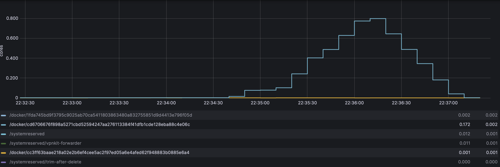
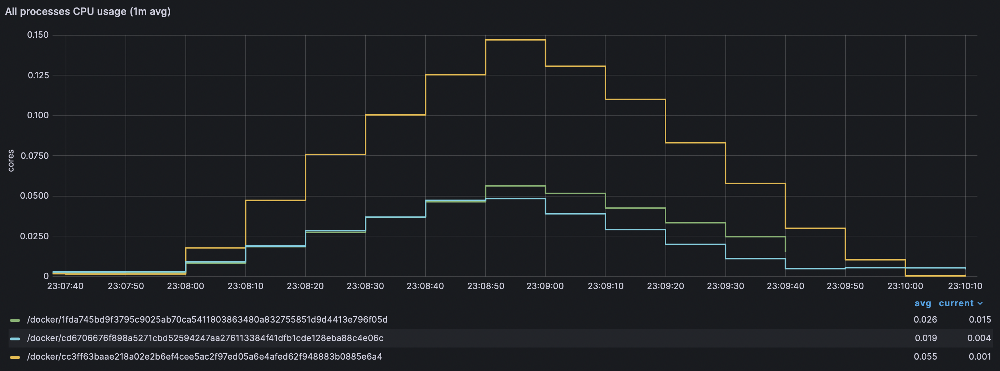
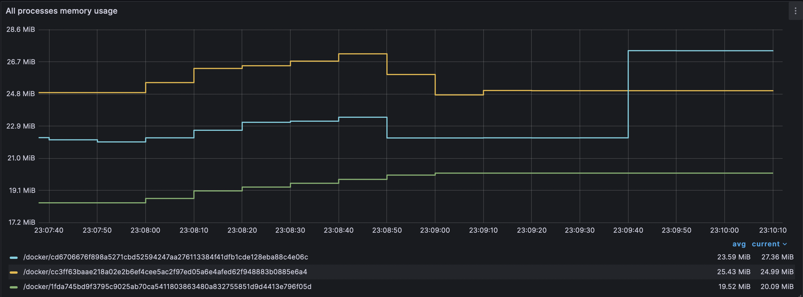
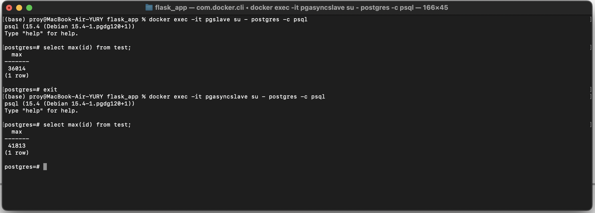
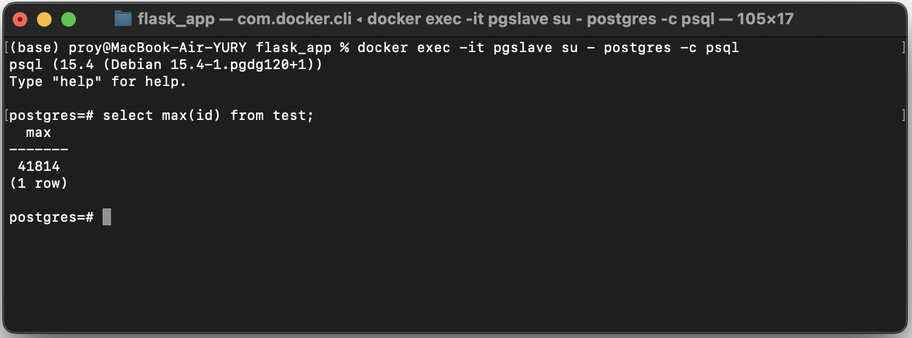

# Тест репликации

1. Для настройки 1 master и 2 slave использовалась [инструкция](https://github.com/OtusTeam/highload/blob/master/lessons/02/05/live/guide.md)

2. Запущен контейнер cAdvisor для сбора метрик с запущенных БД в докере
```
docker run -dit -v "/:/rootfs:ro" -v "/var/run:/var/run:rw" -v "/sys:/sys:ro" -v "/var/lib/docker/:/var/lib/docker:ro"   -v "/sys/fs/cgroup:/sys/fs/cgroup:ro" --privileged --network=pgnet -p "8080:8080" --detach=true --restart=unless-stopped --name cadvisor  gcr.io/cadvisor/cadvisor-arm64:v0.47.2
```
3. Запущено контейнер с Prometheus для хранения метрик
```
docker run -dit -p "9090:9090" --restart=unless-stopped --network=pgnet --name=prometheus bitnami/prometheus
```
и настройки для сбора метрик
```
docker cp volumes/prometheus/prometheus.yml prometheus:/opt/bitnami/prometheus/conf/prometheus.yml 
```

4. Для отображения графиков запущена grafana
```
docker run -dit --volume "$PWD/volumes/grafana/data:/var/lib/grafana" --env-file volumes/grafana/grafana.env -p "3000:3000" --restart=unless-stopped --network=pgnet --name grafana grafana/grafana
```
 В интерфейсе графаны настроен источник данных - Prometheus и установлен пакет дашбордов `Kubernetes cluster monitoring`

5. Методы сервиса настроены таким образом, что чтение осуществляется из реплики, запись в мастер.

6. Нагрузочный тест на чтение с реплики

    

7. Создана новая таблица для тестирования репликации

    ```
    create table test (id SERIAL PRIMARY KEY, message TEXT);
    ```

    Был добавлен метод `PUT /test`, который добавляет в таблицу test новую строку, где ключ id с автоинкрементом.

8. Был запущен тест на вызов метода `PUT /test` с использованием JMeter (10 клиентов в течение 120 секунд вызывали метод без пауз)

   
   

   Мастер потребляет больше CPU и памяти.

10. Затем была остановлена одна из реплик (docker stop)

11. После завершения тестриования был остановлен мастер и запущена остановленная реплика.
  
12. Сверка количества записей в таблице test на репликах отличается.

    

    В реплике, которая была остановлена более чем на 5000 меньше записей.

13. Реплика, в которой записей больше промотировалась до мастера, вторая реплика была подключена к ней по [инструкции (п. 25 - 30)](https://github.com/OtusTeam/highload/blob/master/lessons/02/05/live/guide.md)
14. В результате количество записей синхронизировалось
     
  
